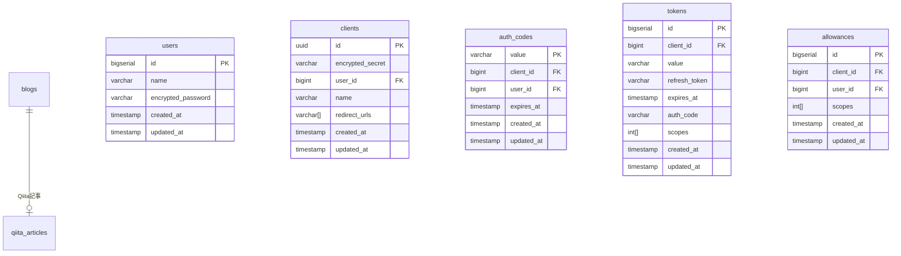

```mermaid
erDiagram
  blogs ||--o| qiita_articles : "Qiita記事"

  users {
    bigserial id PK
    varchar name
    varchar encrypted_password
    timestamp created_at
    timestamp updated_at
  }

  clients {
    uuid id PK
    varchar encrypted_secret
    bigint user_id FK
    varchar name
    varchar[] redirect_urls
    timestamp created_at
    timestamp updated_at
  }
  auth_codes {
    varchar value PK
    bigint client_id FK
    bigint user_id FK
    timestamp expires_at
    timestamp created_at
    timestamp updated_at
  }
  tokens {
    bigserial id PK
    bigint client_id FK
    varchar value
    varchar refresh_token
    timestamp expires_at
    varchar auth_code
    int[] scopes
    timestamp created_at
    timestamp updated_at
  }
  allowances {
    bigserial id PK
    bigint client_id FK
    bigint user_id FK
    int[] scopes
    timestamp created_at
    timestamp updated_at
  }

```
