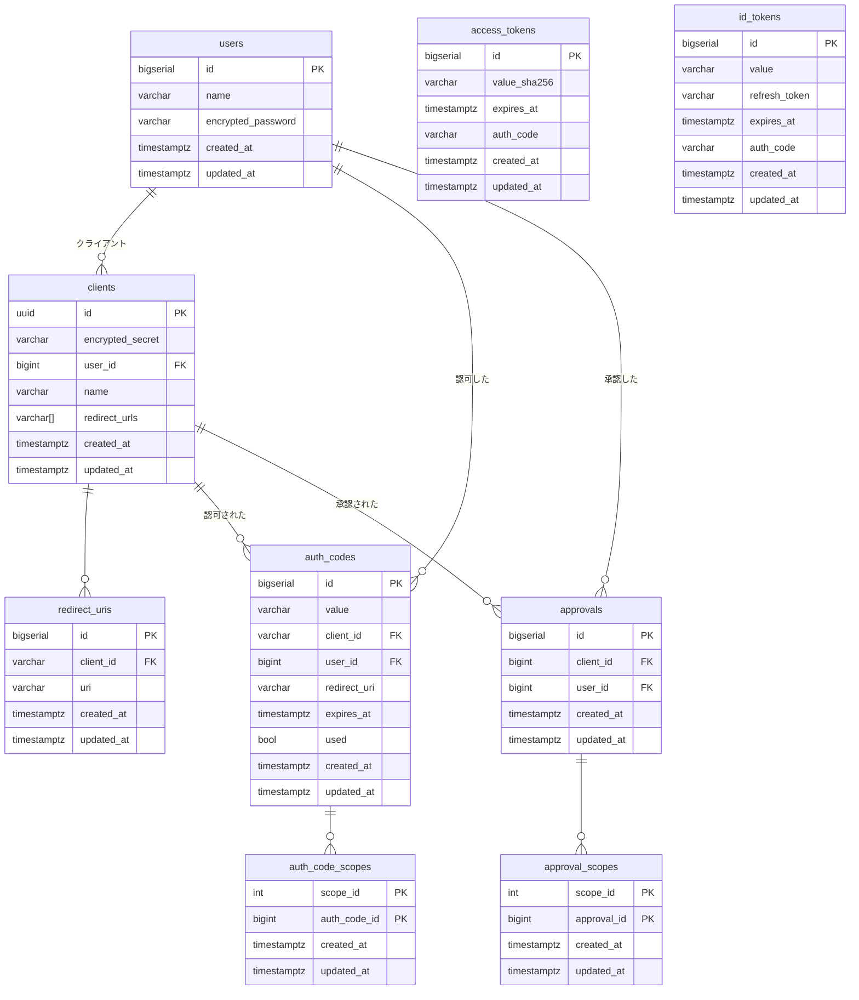

```mermaid
erDiagram
  users ||--o{ clients : "クライアント"
  clients ||--o{ redirect_uris : ""
  users ||--o{ auth_codes : "認可した"
  clients ||--o{ auth_codes : "認可された"
  auth_codes ||--o{ auth_code_scopes : ""
  users ||--o{ approvals : "承認した"
  clients ||--o{ approvals : "承認された"
  approvals ||--o{ approval_scopes : ""

  users {
    bigserial id PK
    varchar name
    varchar encrypted_password
    timestamptz created_at
    timestamptz updated_at
  }

  clients {
    uuid id PK
    varchar encrypted_secret
    bigint user_id FK
    varchar name
    varchar[] redirect_urls
    timestamptz created_at
    timestamptz updated_at
  }
  redirect_uris {
    bigserial id PK
    varchar client_id FK
    varchar uri
    timestamptz created_at
    timestamptz updated_at
  }
  auth_codes {
    bigserial id PK
    varchar value
    varchar client_id FK
    bigint user_id FK
    varchar redirect_uri
    timestamptz expires_at
    bool used
    timestamptz created_at
    timestamptz updated_at
  }
  auth_code_scopes {
    int scope_id PK
    bigint auth_code_id PK
    timestamptz created_at
    timestamptz updated_at
  }
  access_tokens {
    bigserial id PK
    varchar value_sha256
    timestamptz expires_at
    varchar auth_code
    timestamptz created_at
    timestamptz updated_at
  }
  id_tokens {
    bigserial id PK
    varchar value
    varchar refresh_token
    timestamptz expires_at
    varchar auth_code
    timestamptz created_at
    timestamptz updated_at
  }
  approvals {
    bigserial id PK
    bigint client_id FK
    bigint user_id FK
    timestamptz created_at
    timestamptz updated_at
  }
  approval_scopes {
    int scope_id PK
    bigint approval_id PK
    timestamptz created_at
    timestamptz updated_at
  }

```
